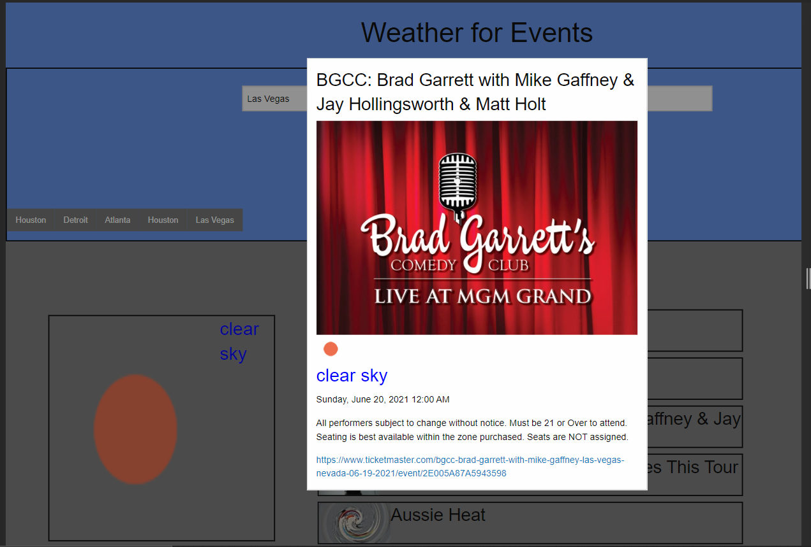

# project-stormhouse
A customer wants to go out of town for a weekend and attend an event. In this website you can search up a city and choose a date, once both inputs have a valid request it will than show you the city you searched and upcoming events. A weather for that current week and city will display for the customers that choose to attend an event that current weekend to plan accordingly. After searching a few cities the recent ones will be saved and display to make it easier for customer to choose.

## Table of Content
1. Search bar to choose a city
2. Start date picker to choose a starting date for events
3. End date picker to choose an end date and give a time frame
4. Weather display for current city 
5. Recent searched cities display

### Screen Shots

### Live Link
## URL
Web page can be located at [Gitpages](https://mrg105.github.io/project-stormhouse/ "Project Stormhouse")

## Repo
Repository can be located at [Github](https://github.com/MrG105/project-stormhouse "Github")

